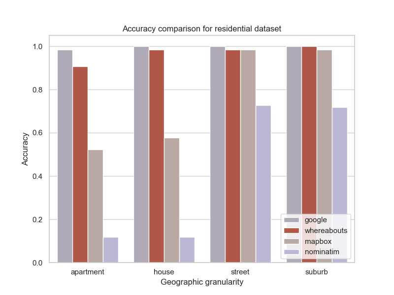
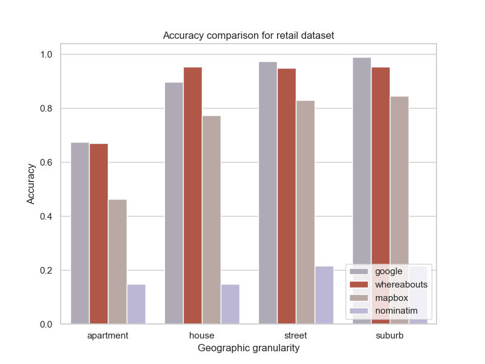

# Summary

`Whereabouts` is a Python package for geocoding address data (standardizing addresses, and assigning latitude and longitude values). It employs a simple but scalable rule-based algorithm implemented in SQL using [DuckDB](https://duckdb.org/). Like other geocoding tools, it relies on a high-quality address reference dataset containing standardized addresses and corresponding coordinates.

The benefits of `Whereabouts` include:

- It is highly scalable, capable of geocoding hundreds of addresses per second.
- It is robust to a range of typographical errors.
- It is simple to install, requiring only two lines of code, compared to other geocoding systems which involving setting up a local server instance.
- It is secure, as it can be installed in a user’s environment without any dependencies on external APIs.

`Whereabouts` is suitable for use with any country's address data and is currently available for Australia, with New Zealand, France, and the United States soon to be available.

Geocoding is a key step in the workflow of many geospatial data science problems, making `Whereabouts` applicable to domains such as healthcare, public health and epidemiology, ecology, transport, logistics, business network planning, marketing, and urban planning.

# Statement of Need

Geocoding is a crucial step in geospatial data science workflows, where unstructured text data is converted into two-dimensional coordinates representing locations on the Earth's surface. There are many commercial providers of geocoding services, but there are two main barriers for users:

1. There can be a substantial cost for researchers using these services.
2. These services require sending data to external servers, which can be prohibited in sensitive domains such as healthcare.

`Whereabouts` addresses the need for a simple, portable, freely available, and secure geocoding solution, applicable across any scientific, business, or academic area that uses unit record-level geospatial data.

Specific applications include:

- **Contact tracing for public health surveillance:** Data is collected about individuals’ movements and locations, often in the form of free-text. Geocoding this text enables subsequent research and analysis.
- **Record linkage for customer analytics:** Businesses and researchers using large databases with person-level information often use home addresses as an identifier. However, these can be entered in various ways. `Whereabouts` standardizes these addresses so that disparate data sources can be linked.
- **Data processing in epidemiological analyses:** Patients’ home addresses and other address information must first be converted to coordinates so that descriptive statistics at different geographies can be generated.

The geocoding algorithms implemented in the package are based on two papers: [@Zhang2017] and [@Zhang2018]. Note that the author of this package was not involved in these publications or the original research.

## Performance

Accuracy and speed were tested using three different datasets, comparing `Whereabouts` to three other geocoding popular systems: Google Geocoding API, Mapbox Geocoding API and Nominatim.

The three datasets were:

1. A dataset of residential addresses from a real estate website.
2. A dataset of retail locations for a fast food business.
3. A dataset of licensed venues from a state government regulatory agency.

These are summarised below:

| Dataset              | Number of Addresses |
|:----------------------:|:---------------------:|
| Residential addresses | 128                 |
| Retail locations      | 194                 |
| Licensed venues       | 8192                |

The first two were used for accuracy comparisons and the last was used to measure the speed.

### Results: Accuracy

The accuracy comparison is shown below.

|  |  |
|:--------------------------------:|:--------------------------------:|

### Results: Speed

Speed was measured by geocoding the 8192 addresses in the licensed venues datasets 7 times and taking the average. This was done using a pre-built database covering all of the state of Victoria, Australia (around 4 million addresses) and another for the entirity of Australia (around 15 million addresses). This was done on a Macbook M3 with 18Gb memory. 

The results were

| Database              | Time to geocode 8192 addresses (seconds) | Average number of addresses / second |
|:----------------------:|:---------------------:| :---------------------: |
| Victoria, Australia | 15.2                 | 538 | 
| All of Australia      | 16.9                 | 484 |

The code and data used for calculating these results are available [here](https://github.com/ajl2718/python_learning/whereabouts_testing/).

# Acknowledgements

This software was developed in the author’s own time, though it was motivated by applications to COVID-19 contact tracing while the author was collaborating with the Victorian Department of Health. The software was first presented at PyConAU 2023 in Adelaide. The author thanks the organizers of the conference for providing an opportunity to present the work.