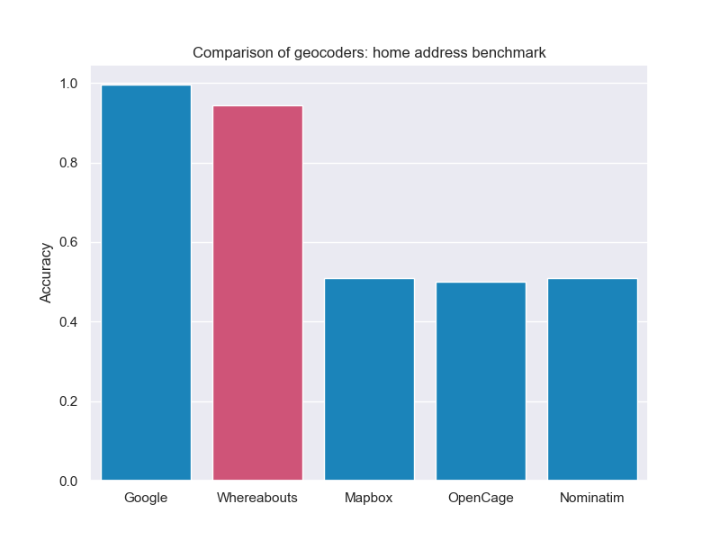

# Whereabouts: A Scalable, Lightweight Open-Source Geocoder for Python

**Author:** Alex Lee  
**Affiliations:**  
Victorian Comprehensive Cancer Centre Data Connect  
Department of General Practice and Primary Care, University of Melbourne  

## Summary

Whereabouts is a Python package for geocoding address data, standardizing addresses, and assigning latitude and longitude values. It uses a simple but scalable rule-based algorithm implemented in SQL using DuckDB. Like other geocoding tools, it relies on a high-quality address reference dataset containing standardized addresses and corresponding coordinates.

The benefits of Whereabouts include:
- It is highly scalable, capable of geocoding thousands of addresses per second.
- It is robust to a range of typographical errors.
- It is simple to install, requiring only two lines of code, compared to other geocoding systems which require a local server.
- It is secure, as it can be installed in a user’s environment without any dependencies on external APIs.

Whereabouts is suitable for use with any country's address data and is currently available for Australia, with New Zealand, France, and the United States soon to be available.

Geocoding is a key step in the workflow of many geospatial data science problems, making Whereabouts applicable to domains such as healthcare, public health and epidemiology, ecology, transport, logistics, business network planning, marketing, and urban planning.

## Statement of Need

Geocoding is a crucial step in geospatial data science workflows, where unstructured text data representing locations is converted into two-dimensional coordinates representing locations on the Earth's surface. There are many commercial providers of geocoding services, but there are two main barriers for users:
1. There can be a substantial cost for researchers using these services.
2. These services require sending data to external servers, which can be prohibited in sensitive domains such as healthcare.

Whereabouts addresses the need for a simple, portable, freely available, and secure geocoding solution, applicable across any scientific, business, or academic area that uses geospatial data.

Specific applications include:
- **Contact tracing for public health surveillance:** Data is collected about individuals’ movements and locations, often in the form of free text. Geocoding this text enables subsequent research and analysis.
- **Record linkage for customer analytics:** Businesses and researchers using large databases with person-level information often use home addresses as an identifier. However, these can be entered in various ways. Whereabouts standardizes these addresses so that disparate data sources can be linked.
- **Data processing in epidemiological analyses:** Patients’ home addresses and other address information must first be converted to coordinates so that descriptive statistics at different geographies can be generated.

## Performance

Accuracy and speed were tested using three different datasets, comparing Whereabouts to four other geocoding systems: Google Geocoding API, Mapbox Geocoding API, Nominatim, and OpenCage.

The three datasets were:
1. A dataset of residential addresses from a real estate website.
2. A dataset of retail locations for a fast food business.
3. A dataset of licensed venues from a state government regulatory agency.

The results are shown below:

| Dataset              | Number of Addresses |
|----------------------|---------------------|
| Residential addresses| 128                 |
| Retail locations     | 194                 |
| Licensed venues      | 8192                |

## References

1. Yuhang Zhang, Tania Churchill, and Kee Siong Ng. "Exploiting Redundancy, Recurrence and Parallelism: How to Link Millions of Addresses with Ten Lines of Code in Ten Minutes." arXiv preprint arXiv:1708.01402, 2017. Available at: [https://doi.org/10.48550/arXiv.1708.01402](https://doi.org/10.48550/arXiv.1708.01402)
2. Yuhang Zhang, Kee Siong Ng, Tania Churchill, and Peter Christen. "Scalable Entity Resolution Using Probabilistic Signatures on Parallel Databases." *Proceedings of the 27th ACM International Conference on Information and Knowledge Management*, CIKM ‘18, 2018, pp. 2213–2221. Association for Computing Machinery, New York, NY, USA. Available at: [https://doi.org/10.1145/3269206.3272016](https://doi.org/10.1145/3269206.3272016).

## Acknowledgements

This software was developed in the author’s own time outside of their usual work, though it was motivated by applications to COVID-19 contact tracing while the author was collaborating with the Victorian Department of Health. The software was first presented at PyConAU 2023 in Adelaide. The author acknowledges the organizers of the conference for providing an opportunity to present the work and for waiving the registration fees for attending the conference.
