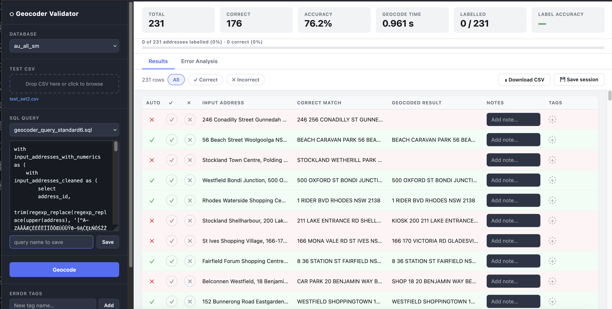

# Evaluation App

This folder contains an app that is used to evaluate the performance of the geocoding algorithm against benchmarking datasets, allowing the user to compare different versions of the algorithm.

## Features
The evaluation app allows a user to compare the algorithms' outputs against a ground truth, as well as carry out error analysis to identify patterns in the types of errors that are occurring.

- Geocoding for producing results from the geocoder (with a given version of the algorithm)
- Coding options: the user can enter their own labels for different types of errors that arise in the geocoding
- Error analysis: this tab displays the counts of different error types that have been defined by the user
- Headline statistics such as overall accuracy, time and proportion labelled, are displayed at the top of the screen

## Input structure
The csv file should be structured in one of two ways:
1)  with the column `input_address` and no other columns
2)  with the columns `input_address` and `correct_match` with no additional columns

In the first case the tool can be used to geocode a set of input addresses that can then be reviewed by a human labelled (or LLM). In the second case the tool is used to compare the results from the geocoding with a gold-standard. 

## Usage
- Select a database from the list. These are located in the `models` folder so if none are visible then one will need to be created
- Select a test set
- Select an SQL query from the dropdown list. This will be displayed in the text box below.
- Press `Geocode` to geocode the input_address values

